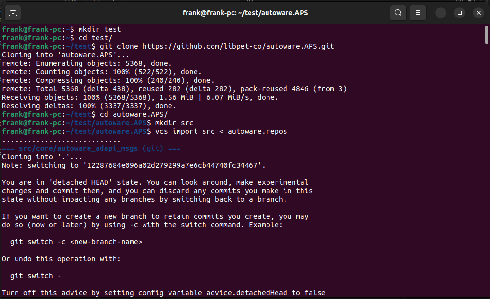
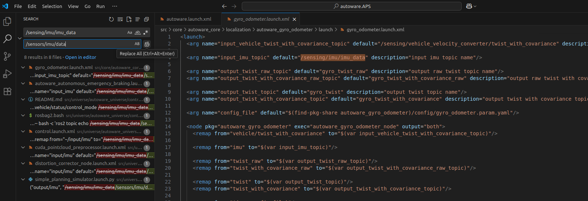
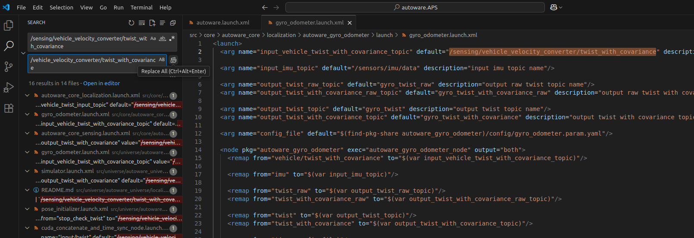
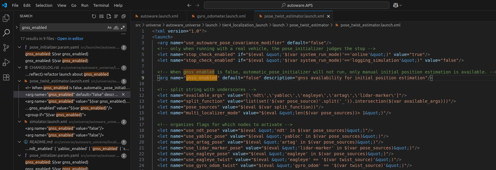

# localization+planner+controller 调试日志

完成 step1_autoware_dependency_install_and_initial_run 和 step2_localizaiton_debugging 后再进行此操作

[配套的视频教程](https://drive.google.com/file/d/1x6FAHwasYiO8vMzH_WgQzLgChDYvk236/view?usp=sharing)

## step 1 下载源码
下载源码

```
git clone https://github.com/libpet-co/autoware.APS.git
cd autoware.APS
mkdir src
vcs import src < autoware.repos
```


## step 2 下载测试用的 ros2 bag 数据和 地图数据

注意文件下载路径：可以在home下创建和下载数据，或者根据自己情况指定

1. ros2 bag 数据包含 imu 数据和 vehicle interface 数据
```
mkdir ros2_bag_data
gdown -O ros2_bag_data/rosbag2_2025_07_21-14_12_57.zip https://drive.google.com/uc?id=1gdhUmAzXyBWIGrEAqnjXgw9N4H-alEqG
unzip -d ros2_bag_data rosbag2_2025_07_21-14_12_57.zip
```
2. 下载测试用地图数据

```
mkdir test_map
gdown -O test_map/sample-map-planning-APS.zip https://drive.google.com/uc?id=19PaxactEaybAZfU5lb4TlHDOIGFgKzBc
unzip -d test_map/ test_map/sample-map-planning-APS.zip
```
3. 下载vehicle APS的三维模型
```
gdown -O src/launcher/autoware_launch_APS/vehicle/aps_vehicle_launch/aps_vehicle_description/mesh/aps2.dae  'https://drive.google.com/uc?id=1ZEu_IYBXvrCy5azXOEOhSrONRucKTkT_'
```
## step 3 编译

一定要先下载数据再编译，因为车辆模型数据aps2.dae 要随着编译 安装到install文件夹。

```
colcon build --symlink-install --cmake-args -DCMAKE_BUILD_TYPE=Release
```
## step 4 更改一些参数

1.change use_sim_time

如果是ros2 bag 数据仿真，把下图中的"use_sim_time = true" , 如果在实车运行 "use_sim_time = false"  


2.改变imu话题名为自己传感器的话题 

查找和替换imu话题名



3.更改twist话题名为interface反馈的话题名字



4.使用gnss设置为false



## step 5 启动程序

注意map_path:=/home/frank/test_map/sample-map-planning-APS改为自己的地图所在的路径

```
source install/setup.bash
ros2 launch autoware_launch autoware.launch.xml map_path:=/home/frank/test_map/sample-map-planning-APS vehicle_model:=aps_vehicle sensor_model:=aps_sensor_kit
```

## step 6 回放数据包

```
unzip rosbag2_2025_07_21-14_12_57.zip 
ros2 bag play rosbag2_2025_07_21-14_12_57/ --clock
```

## step 7 使用rviz初始化并设置路径

[参考视频教程](https://drive.google.com/file/d/1x6FAHwasYiO8vMzH_WgQzLgChDYvk236/view?usp=sharing)